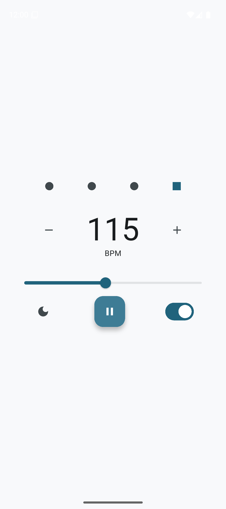
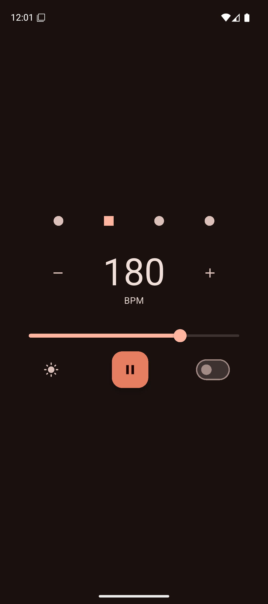

<a id="readme-top"></a>
<div align="center">
  


</div>
<br />
<div align="center">
  <a href="https://github.com/GreatApe77/metronome"> 
  </a>

  <h3 align="center">Metronome</h3>

  <p align="center">
    A simple and effective metronome application built with Flutter.
    <br />
    <br />
    &middot;
    <a href="https://github.com/GreatApe77/metronome/issues/new?labels=bug&template=bug-report---.md">Report Bug</a> &middot;
    <a href="https://github.com/GreatApe77/metronome/issues/new?labels=enhancement&template=feature-request---.md">Request Feature</a> </p> </div>


<details>
  <summary>Table of Contents</summary>
  <ol>
    <li>
      <a href="#about-the-project">About The Project</a>
      <ul>
        <li><a href="#built-with">Built With</a></li>
      </ul>
    </li>
    <li>
      <a href="#getting-started">Getting Started</a>
      <ul>
        <li><a href="#prerequisites">Prerequisites</a></li>
        <li><a href="#installation">Installation</a></li>
        <li><a href="#running-tests">Running Tests</a></li>
      </ul>
    </li>
    <li><a href="#contributing">Contributing</a></li>
  </ol>
</details>


## About The Project

<div align="center">
    
    

</div>


This Metronome app is a mobile application built using Flutter, designed to provide musicians with a simple and reliable tool for time-keeping. It offers adjustable BPM, visual feedback, and clear audio cues for practice sessions.

Key features include:
* **Adjustable BPM:** Easily set the tempo from 1 to 250 beats per minute using a slider or increment/decrement buttons.
* **Play/Pause Control:** Start and stop the metronome at any time.
* **Visual Beat Indicator:** A measure bar visually displays the current beat in a 4-beat measure.
* **Accent on First Beat:** Option to enable an accented sound for the first beat of each measure.
* **Audio Cues:** Utilizes distinct sound files for regular and accented ticks.
* **Theme Toggle:** Switch between light and dark themes for user preference, with the choice persisted across sessions.

<p align="right">(<a href="#readme-top">back to top</a>)</p>


### Built With

This project is built with Flutter and leverages the following major libraries/frameworks:

* [Flutter](https://flutter.dev)
* [Bloc](https://bloclibrary.dev/)
* [FlutterSoloud](https://pub.dev/packages/flutter_soloud)
* [Hydrated Bloc](https://pub.dev/packages/hydrated_bloc)

<p align="right">(<a href="#readme-top">back to top</a>)</p>


## Getting Started

To get a local copy up and running, follow these simple steps.

### Prerequisites

Ensure you have the Flutter SDK installed on your system.

* **Flutter SDK v3.29.0** 
    For installation instructions, please refer to the [official Flutter documentation](https://flutter.dev/docs/get-started/install).

### Installation

1.  Clone the repo

    ```sh
    git clone https://github.com/GreatApe77/metronome.git
    ```
2.  Navigate to the project directory

    ```sh
    cd metronome
    ```
3.  Install Flutter packages

    ```sh
    flutter pub get
    ```
4.  Run the app

    ```sh
    flutter run
    ```
5.  For Android Emulator, ensure you have an emulator running or a device connected.

<p align="right">(<a href="#readme-top">back to top</a>)</p>

### Running Tests

This project includes unit tests to ensure code quality and functionality. Tests are located in the `test` directory.

To run the unit tests, use the following command in your terminal from the project's root directory:

```sh
flutter test
```

## Contributing

Contributions are what make the open source community such an amazing place to learn, inspire, and create. Any contributions you make are **greatly appreciated**.

If you have a suggestion that would make this better, please fork the repo and create a pull request. You can also simply open an issue with the tag "enhancement".
Don't forget to give the project a star! Thanks again!

1.  Fork the Project
2.  Create your Feature Branch (`git checkout -b feature/AmazingFeature`)
3.  Commit your Changes (`git commit -m 'Add some AmazingFeature'`)
4.  Push to the Branch (`git push origin feature/AmazingFeature`)
5.  Open a Pull Request

<p align="right">(<a href="#readme-top">back to top</a>)</p>